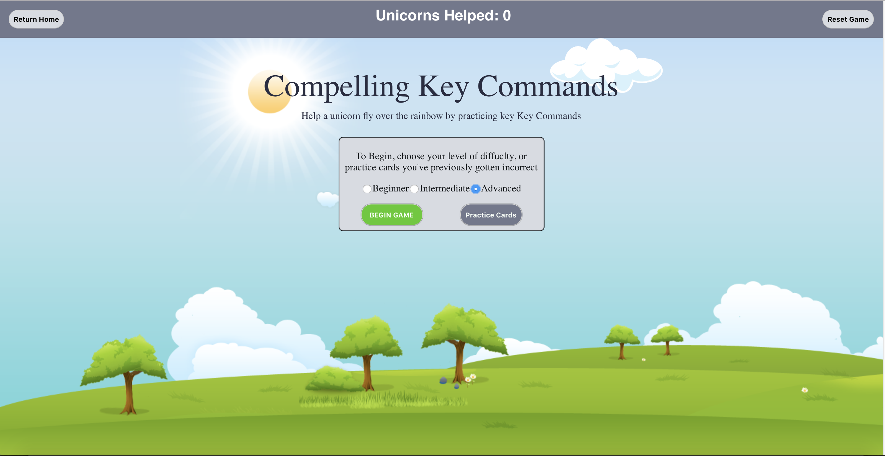

### Description

This project is built to give the user a way to practice keyboard shortcut commands by being prompeted with flashcards.
The incorrect cards are then saved to local storage for the user to practice at a later time. 

### Installation

To install, first clone down this repo `https://github.com/lboyer4/keyboardCommands.git` 

next, `run npm install`

### Screenshots

### Learning Goals

The main goal of this project was to create a functioning flashcard app using React and TDD.

Other learning goals included writing DRY code, using local stroage, and fetching an API
